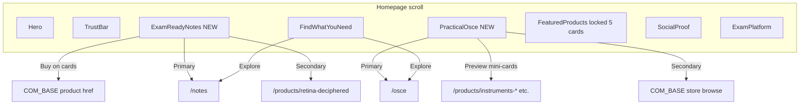
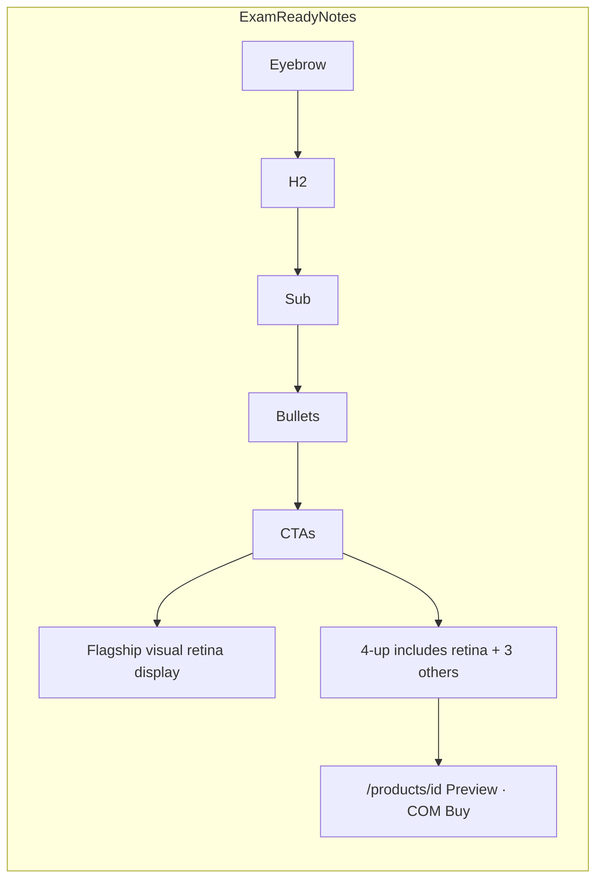
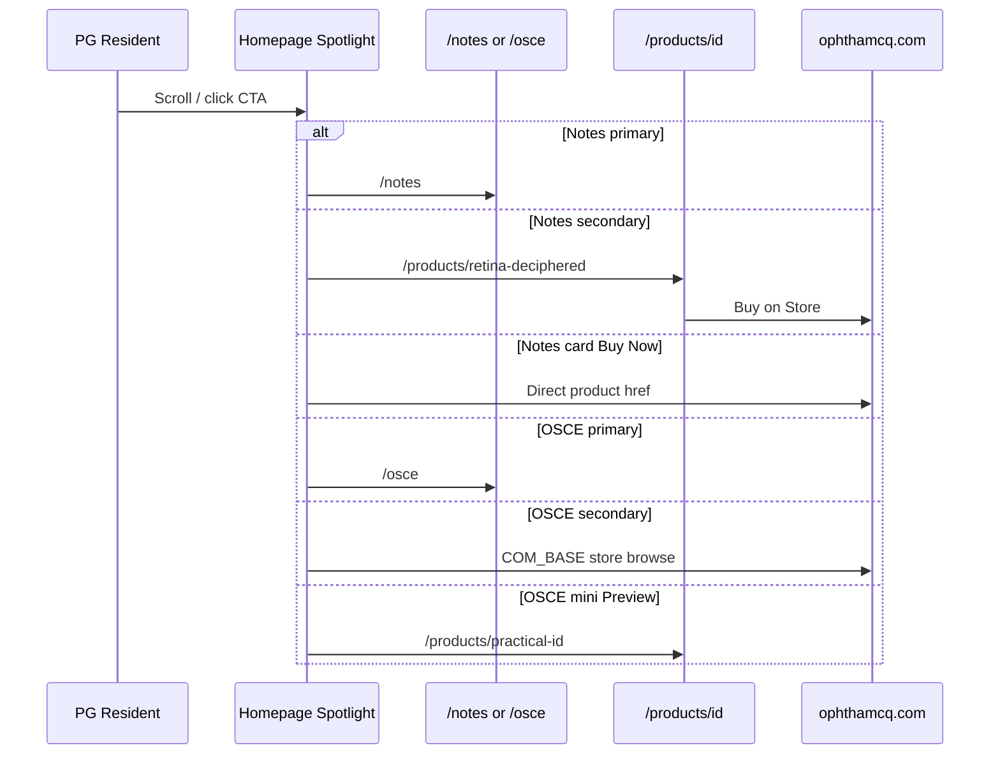

# Design: Homepage Product Spotlights — Exam Ready Notes & Practical/OSCE Bundle

| Field | Value |
|-------|-------|
| **Author** | Engineering / Design (draft) |
| **Date** | 2026-07-12 |
| **Status** | Approved (rev 4 — freeness confirmed free for DNB/MS/DO; implement PR1 Notes first) |
| **Scope** | Marketing site homepage (`src/pages/index.astro`) + related section components |
| **Sites** | Marketing: `https://www.ophthamcq.org` · Commerce: `https://www.ophthamcq.com` (`COM_BASE`) |

---

## Overview

The OphthaMCQ marketing homepage currently buries two high-intent product lines inside generic navigation and a mixed product grid:

1. **Exam Ready Handwritten Notes** — the brand’s strongest differentiator (“world’s only handwritten PG ophthalmology notes”)
2. **Practical / OSCE / Viva Complete Data** — a new-launch practical prep path for DNB/MS/DO candidates

Today, Notes and OSCE appear only as small cards in `FindWhatYouNeed` (“Browse by Product”) and as one card each inside `FeaturedProducts`. Neither line gets a dedicated conversion section with proof, product depth, or dual CTAs. An unused prototype `HeroProduct.astro` already sketches a Notes spotlight but is not imported anywhere.

This design introduces **two full-width homepage spotlight sections** — `ExamReadyNotes.astro` and `PracticalOsce.astro` — placed after trust/navigation and before social proof. Supporting cleanup demotes the FeaturedProducts OSCE card and locks a 5-SKU commercial grid so Notes/OSCE are not thrice-featured at equal weight. **FindWhatYouNeed product row stays as-is** (non-goal to redesign hub copy in v1).

---

## Background & Motivation

### Current homepage stack

From `src/pages/index.astro`:

```
Hero
TrustBar
FindWhatYouNeed     ← small Notes + OSCE cards under "Browse by Product" (unchanged in v1)
FeaturedProducts    ← 5 products + 1 OSCE card in a 3-col grid
SocialProof
ExamPlatform
WhyOphthaMCQ
BlogPreview
FAQ
FinalCTA
```

### Pain points

| Issue | Evidence | Impact |
|-------|----------|--------|
| Notes buried in grid | `FeaturedProducts` shows `retina-deciphered` and `glaucoma-notes` as equal peers of MCQ banks | Handwritten differentiator is not owned as a *category* on the homepage |
| OSCE is a single emerald card | `FeaturedProducts.astro` lines 15–20 and 94–120; also card in `FindWhatYouNeed` | New launch competes with 5 priced products; no station breakdown |
| Duplicate shallow mentions | Notes/OSCE in FindWhatYouNeed, FeaturedProducts, WhyOphthaMCQ | Cognitive noise without conversion depth |
| Dead Notes prototype | `HeroProduct.astro` implements a Notes spotlight but has **zero imports** | Risk of double-shipping Notes if someone re-enables it later |
| Commercial OSCE CTA is generic | `osce.astro` CTA → bare `COM_BASE` | Bundle store destination is under-specified |
| Free-claim funnel risk | Live `osce.astro` says “Free for DNB…”; paid practical PDFs exist in `PRODUCTS` | PR2 **must strip free claim on `/osce` and homepage together** until freeness confirmed |

### Existing assets we reuse

- Product catalog: `PRODUCTS` in `src/config.ts` (`category: 'notes'`, prices, images, `.com` hrefs)
- Destination landings: `src/pages/notes.astro`, `src/pages/osce.astro`
- Product detail: `src/pages/products/[id].astro`
- Patterns: `Icon.astro`, rounded-2xl cards, sky-600 primary / emerald “New Launch”, white ↔ slate-50 section rhythm
- Social proof: `TESTIMONIALS` (Dr. Garvesh Surya on notes; Dr. Sangam Rout on DNB)
- Dead prototype to delete: `src/components/sections/HeroProduct.astro`

---

## Goals & Non-Goals

### Goals

1. Convert PG residents into **Notes** buyers/visitors via a dedicated homepage section with 4 featured note sets + clear path to `/notes`.
2. Convert DNB/MS/DO practical candidates into **OSCE** visitors via a dedicated section with station grid + path to `/osce` and store browse.
3. Preserve mobile-first layout, SEO heading hierarchy, and existing visual language.
4. Keep data config-driven where product IDs already exist; avoid hardcoding prices/images.
5. Reduce redundancy: remove FeaturedProducts OSCE card and demote second notes SKU from the grid **in the same release train as the OSCE spotlight**.

### Non-Goals

- Redesigning Hero, ExamPlatform, or full `/notes` / `/osce` pages (spotlights link into them).
- **Redesigning or “sliming” FindWhatYouNeed product-row copy** — keep current Notes/OSCE hub cards and subcopy as-is in v1.
- Building a new OSCE product SKU in `PRODUCTS` (bundle remains landing-page mediated unless product owner adds an ID later).
- Checkout, auth, or paywall work on `.org` (always redirect to `COM_BASE`).
- A/B test infrastructure or GTM/Plausible installation (attrs-only optional; no metrics until a tracker exists).
- Replacing FeaturedProducts entirely with MCQ-only (we slim it, not kill it).
- Inventing a `/products` index page.
- **Exam pills row on ExamReadyNotes** (out of v1; exam hub already exists).

---

## Proposed Design

### Placement & information architecture

**Recommended stack after this change:**

```
Hero                  white
TrustBar              slate-50
FindWhatYouNeed       slate-50   ← keep exams hub + product row as-is (no slim redesign)
ExamReadyNotes        white      ← NEW Section 1 (replaces dead HeroProduct intent)
PracticalOsce         slate-50   ← NEW Section 2
FeaturedProducts      white      ← locked 5 commercial cards, 0 OSCE card
SocialProof           white
ExamPlatform          white
WhyOphthaMCQ          slate-50
BlogPreview
FAQ
FinalCTA
```



#### Why this order

1. **Hero → TrustBar** establishes brand + credibility (unchanged).
2. **FindWhatYouNeed** remains the exam-router and light product hub — **unchanged in v1**.
3. **ExamReadyNotes next** — notes are the highest-margin, highest-differentiation SKU family.
4. **PracticalOsce immediately after** — practical-focused DNB residents get a full section; adjacency contrasts theory vs practical.
5. **FeaturedProducts after spotlights** — “more bestsellers & MCQ banks,” not the primary Notes/OSCE story.

#### Demotions / cleanup (locked)

| Location | Change | Rationale |
|----------|--------|-----------|
| `FeaturedProducts` | **Remove** OSCE card entirely | Spotlight owns OSCE; ship removal **in same PR as PracticalOsce** |
| `FeaturedProducts` | **Locked `cards` array** (see below) | No implementer guesswork |
| `FeaturedProducts` footer | Dual links: **Browse all notes** → `/notes`; **Browse by exam** → `/exams` | No `/products` index exists; do not invent one; do not point “all products” at `/notes` |
| `FindWhatYouNeed` | **No change** in v1 | Non-goal; hub cards remain jump-links with current copy |
| `WhyOphthaMCQ` | No change in v1 | Trust framing differs from conversion sections |
| `HeroProduct.astro` | **Delete** in PR1 | Dead code; superseded by `ExamReadyNotes.astro` |

##### Authoritative FeaturedProducts cards (post-cleanup)

```ts
// src/components/sections/FeaturedProducts.astro — replace current cards + remove osce object
const cards = [
  { id: 'retina-deciphered',    badge: 'Most Popular', badgeColor: 'sky' },
  { id: 'ico-fico-past-papers', badge: 'Best Value',   badgeColor: 'sky' },
  { id: 'faico-mcqs',           badge: 'FAICO',        badgeColor: 'violet' },
  { id: 'high-yield-mcqs',      badge: 'High Yield',   badgeColor: 'sky' },
  { id: 'pdcet-mcqs',           badge: 'New',          badgeColor: 'amber' },
];
// no OSCE card
```

**Footer markup intent:**

```html
<div class="mt-12 flex flex-col sm:flex-row items-center justify-center gap-3">
  <a href="/notes">Browse all notes</a>
  <a href="/exams">Browse by exam</a>
</div>
```

Both use existing secondary-button styling (white bg, slate border, sky hover) matching current “View All Products” button.

---

## Section 1 — Exam Ready Notes

**Component:** `src/components/sections/ExamReadyNotes.astro` (new)  
**Supersedes:** `src/components/sections/HeroProduct.astro` (**delete** in PR1)  
**Section id:** `id="exam-ready-notes"`  
**Section classes:** `bg-white py-20 lg:py-28` (parity with `FeaturedProducts`, `SocialProof`, `WhyOphthaMCQ`)

### Layout

**Desktop (lg+):** Split hero — `lg:grid-cols-2 gap-12 items-center`. Left: copy + CTAs + quote. Right: **flagship display only** for `retina-deciphered` (large image + name + price chip; **not** a second buy path beyond the grid). Below the split: **4-up product grid** that **includes retina again** (intentional double-surface: large visual for brand + full card for price/Preview/Buy actions).

**Why double-surface retina:** Flagship visual sells the handwritten aesthetic; the 4-up card carries the standard dual-action pattern (Preview internal / Buy external). Avoid a third path on the flagship image (image is non-clickable or wraps to `/products/retina-deciphered` only — prefer non-clickable decorative with price caption).

**Mobile:** Stack — eyebrow → H2 → subcopy → bullets → primary CTA → secondary CTA → flagship image → 4 product cards (`grid-cols-1 sm:grid-cols-2 lg:grid-cols-4`). No carousel JS.

```
DESKTOP (max-w-7xl)
┌─────────────────────────────────────────────────────────────┐
│ LEFT (~50%)                    │ RIGHT (~50%)               │
│ [eyebrow pill]                 │ ┌─────────────────────────┐│
│ H2 …                           │ │ Flagship image          ││
│ subcopy                        │ │ retina-deciphered       ││
│ • bullets                      │ │ Most Popular · ₹549     ││
│ [Browse All Note Sets → /notes]│ │ (display-only / caption)││
│ [Preview Retina Deciphered]    │ └─────────────────────────┘│
│   → /products/retina-deciphered│                            │
│ quote chip (Garvesh)           │                            │
├─────────────────────────────────────────────────────────────┤
│ 4-up grid (INCLUDES retina-deciphered again — intentional): │
│ [retina] [glaucoma] [optics] [anatomy]                      │
│ each: Preview → /products/id · Buy Now → COM product href   │
└─────────────────────────────────────────────────────────────┘
```



### Copy hierarchy (production-ready)

| Role | Copy |
|------|------|
| **Eyebrow** | `Handwritten · Not Typed PDFs` |
| **H2** (`id="exam-ready-notes-heading"`) | `Exam Ready Notes Handwritten for PG Ophthalmologists` |
| **Subcopy** | `Genuinely handwritten pages distilled from Kanski, Ryan, Elkington and BCSC — built by ophthalmologists who cleared FRCOphth, ICO/FICO, FAICO, DNB and NEET-SS. Revise a full topic in 45–90 minutes, not a weekend.` |
| **Proof bullets** | (1) `Genuine handwriting — scanned crisp for phone & print` (2) `120–250 pages per topic with exam-style diagrams` *(source: `notes.astro` “What's inside each note set”)* (3) `Lifetime access · PDF + iOS/Android app sync` (4) `From ₹249 per topic` *(floor price matches `eyelids-notes`)* |
| **Primary CTA** | `Browse All Note Sets` → `/notes` (sky-600 solid) |
| **Secondary CTA** | `Preview Retina Deciphered` → **`/products/retina-deciphered`** (internal; white + slate border) — **not** a store link |
| **Tertiary (on 4-up cards only)** | `Buy Now` → product `href` on COM_BASE (`target="_blank" rel="noopener noreferrer"`) |
| **Social proof chip** | `"The exam ready notes have my heart — extremely helpful for my DNB finals." — Dr. Garvesh Surya, MS Ophthalmology` (from `TESTIMONIALS`) |
| **Exam pills** | **Out of v1 — do not implement.** Exam routing already lives in FindWhatYouNeed / ExamPlatform. (If product later wants pills, use the slug map in Implementation Notes — not invent paths.) |

### Featured products (config-driven)

| Order | Product ID | Badge | Role |
|-------|------------|-------|------|
| Flagship visual + grid #1 | `retina-deciphered` | Most Popular | Double-surfaced intentionally |
| Grid #2 | `glaucoma-notes` | Top Seller | Strong DNB/FAICO |
| Grid #3 | `optics-notes` | Premium | Hard topic; premium signal |
| Grid #4 | `anatomy-notes` | Basics | FRCOphth/ICO/PDCET entry |

**Do not feature here:** `short-term-phaco`; practical-adjacent sets (OSCE section): `instruments-in-ophthalmology-notes`, `case-presentation-format-notes`, `ophthalmology-drugs-practical-pdf`, `instruments-drugs-practical-viva`, `read-ophthalmology-reports-tests`.

Optional text links under grid: Eyelids · Recent Advances · Rings/Dots/Lines/Spots → `/products/{id}`.

### Visual design tokens (Notes)

| Token | Value | Intent |
|-------|-------|--------|
| Section padding | `py-20 lg:py-28` | Match homepage section parity |
| Section bg | `bg-white` | Paper / clean study surface |
| Accent | `sky-600` CTAs, `sky-50` icon wells | Brand primary |
| Paper aesthetic | Soft shadow on flagship; optional `bg-amber-50/40` frame; `border-slate-200` | Notebook suggestion without script fonts |
| Badge / discount | Existing sky / emerald chips | Match `FeaturedProducts` |
| Icon | `Icon name="notes"` | Existing |

**Avoid:** script fonts, lined-paper backgrounds, sepia filters. Prefer real `PRODUCTS[].image` CDN assets.

### Card structure (each of 4)

Mirror `FeaturedProducts` dual-action cards:

- Image (`h-40`–`h-44`, `object-cover`, `loading="lazy"`; flagship visual also lazy — below Hero/Trust/FindWhatYouNeed)
- Badge, `h3` = `product.name`, `line-clamp-2` description
- Price row: `price`, `oldPrice`, `discount`
- **Preview** → `/products/${id}` (secondary button)
- **Buy Now** → `product.href` external

---

## Section 2 — Practical / OSCE / Viva

**Component:** `src/components/sections/PracticalOsce.astro`  
**Section id:** `id="practical-osce"`  
**Section classes:** `bg-slate-50 py-20 lg:py-28`

### Default commercial model (locked for ship)

| Element | Default decision | Rationale |
|---------|------------------|-----------|
| Homepage eyebrow / badge | **`New Launch · DNB / MS / DO Practical`** — **no free claim** | Ship-safe until freeness confirmed |
| **`/osce` landing badge (PR2 hard gate)** | **Always update in same PR as PracticalOsce.** Replace live copy `New Launch — Free for DNB / MS / DO residents` with **`New Launch — DNB / MS / DO practical prep`** (or identical non-free wording to homepage). | Primary CTA funnels to `/osce`; homepage + landing must stay consistent. **Do not ship PracticalOsce to production while `/osce` still says Free.** |
| Primary CTA | `Explore OSCE Bundle` → `/osce` | SEO + full station detail (landing now free-claim-safe under default) |
| Secondary CTA | `Browse store for practical resources` → `COM_BASE` (`target="_blank" rel="noopener noreferrer"`) | Honest label: store home, not a specific SKU |
| Practical mini-cards heading | Marketing only: **`À-la-carte practical deep-dives`** + subline **`Individual topic PDFs — sold separately on the store.`** | No engineer/legal meta on the page |
| Mini-card actions (v1 **required**) | **Both Preview + Buy** on every mini-card — same dual-CTA pattern as `FeaturedProducts`: **Preview** (outline / white border, internal `/products/{id}`) + **Buy** (filled secondary, external `product.href`, `target="_blank" rel="noopener noreferrer"`) | Not optional; QA pass/fail is dual buttons present |
| Freeness re-add later | Separate copy PR may restore free language on **homepage and `/osce` together** only after product owner confirms | Never re-introduce free on one surface alone |

**TODO in code** next to store const:

```ts
// TODO(product): replace COM_BASE with PRODUCTS.find(p => p.id === 'osce-…')?.href when SKU exists
const storeHref = COM_BASE;
```

### Layout

**Desktop / tablet / mobile stations grid:** Match proven `/osce` pattern:

```
grid-cols-1 sm:grid-cols-2 lg:grid-cols-3 gap-6
```

**Do not** use `lg:grid-cols-5` — five equal columns are too narrow for 1–2 sentence bodies (~200px).

**Station interaction model:** **Non-clickable summary cards.** No per-station links, no `/osce#…` anchors. Navigation is owned by the section primary CTA. All stations use **`Icon name="check"`** in `bg-emerald-50` wells (`text-emerald-600`) for parity with `osce.astro` — do not invent per-station icons.

Then a **related practical PDFs** strip (3 mini-cards) under a clear heading.

```
DESKTOP
┌─────────────────────────────────────────────────────────────┐
│ [● New Launch · DNB / MS / DO Practical]  ← no free claim   │
│ H2: Ophthalmology Practical, OSCE & Viva — Complete Data    │
│ subcopy...                                                  │
│ [Explore OSCE Bundle → /osce]  (/osce badge also stripped)  │
│ [Browse store for practical resources ↗ COM_BASE]           │
├─────────────────────────────────────────────────────────────┤
│ Stations: grid-cols-1 sm:grid-cols-2 lg:grid-cols-3         │
│ (5 non-clickable cards, Icon check each)                    │
├─────────────────────────────────────────────────────────────┤
│ À-la-carte practical deep-dives                             │
│ Individual topic PDFs — sold separately on the store.       │
│ [instruments] [case format] [instruments-drugs-viva]        │
│ each: Preview (outline) + Buy (filled external) — both req  │
└─────────────────────────────────────────────────────────────┘
```

Reuse station content from `src/pages/osce.astro`:

| Station | Body |
|---------|------|
| OSCE Stations | Communication, examination and data interpretation stations modeled on DNB and MS practical exams. |
| Instruments | Identification, parts and clinical use for every instrument on the practical exam table. |
| Case Presentation | Long and short case templates — history, examination, diagnosis, investigations and management. |
| Investigations | OCT, FFA, perimetry, USG, A-scan, B-scan, keratometry — how to read and present in viva. |
| Viva Voce | Hot questions from recent passers across all subspecialties with structured 60-second answers. |

### Copy hierarchy

| Role | Copy |
|------|------|
| **Eyebrow** | `New Launch · DNB / MS / DO Practical` (emerald pulse optional; **no free claim**) |
| **H2** (`id="practical-osce-heading"`) | `Ophthalmology Practical, OSCE & Viva — Complete Data` |
| **Subcopy** | `One path for the practical exam table: OSCE stations, instruments, case presentation, investigations and viva voce — built by ophthalmologists who passed DNB/MS/DO. Walk in ready, not memorising last-minute PDFs.` |
| **Primary CTA** | `Explore OSCE Bundle` → `/osce` (`bg-emerald-600`) |
| **Secondary CTA** | `Browse store for practical resources` → `COM_BASE` (outline / white) |
| **Audience line** | `For DNB · MS · DO practical exam candidates` |
| **Mini-grid heading** | `À-la-carte practical deep-dives` |
| **Mini-grid subline** | `Individual topic PDFs — sold separately on the store.` *(marketing only — no legal/meta phrases)* |
| **Social proof** | `"The quality of explanations is super so so good. Cleared my DNB theory in first attempt." — Dr. Sangam Rout, DNB Ophthalmology, AIIMS` (default until a practical-specific quote exists) |

### Related practical products

| Product ID | Role |
|------------|------|
| `instruments-in-ophthalmology-notes` | Instruments deep-dive |
| `case-presentation-format-notes` | Case templates |
| `instruments-drugs-practical-viva` | Combined practical/viva |

Mini-card actions (**both required in v1**, FeaturedProducts dual-CTA parity):

| Button | Style | Destination |
|--------|-------|-------------|
| **Preview** | Outline / white bg + slate border (card-level primary for browse) | `/products/{id}` same-site |
| **Buy** | Filled sky or emerald-outline secondary (`bg-sky-600` or compact filled) | `product.href` external + `noopener noreferrer` |

Do **not** ship Preview-only mini-cards.

### Visual design tokens (OSCE)

| Token | Value | Intent |
|-------|-------|--------|
| Padding | `py-20 lg:py-28` | Homepage parity |
| Section bg | `bg-slate-50` | Alternates after Notes white |
| Accent | Emerald New Launch + primary CTA | Differs from Notes sky |
| Station cards | `bg-white border-slate-200`; icon well `bg-emerald-50`; **all `Icon name="check"`** | Clinical checklist |
| Top badge | `bg-emerald-50 border-emerald-100 text-emerald-700` | New Launch only |

---

## Content Model

### Static vs config-driven

| Data | Source | Notes |
|------|--------|-------|
| Featured note IDs + badges | Local const in `ExamReadyNotes.astro` | Same pattern as FeaturedProducts |
| FeaturedProducts commercial IDs | **Locked array** in `FeaturedProducts.astro` (above) | Authoritative |
| Product fields | `PRODUCTS` in `src/config.ts` | Single source of truth |
| OSCE stations | Prefer extract `src/data/osce-stations.ts` shared by `osce.astro` + `PracticalOsce.astro`; else duplicate once | DRY if dual-import |
| OSCE bundle metadata | Component const: `badge: 'New Launch'`, `href: '/osce'`, `storeHref: COM_BASE` | No free flag in default |
| Testimonials | `TESTIMONIALS` | Notes: Garvesh; OSCE: Sangam |
| Exam pills | **Out of v1** | Do not implement on ExamReadyNotes |

### Component data shapes

```ts
// ExamReadyNotes.astro
import { PRODUCTS, TESTIMONIALS } from '../../config';

const featuredNoteIds = [
  { id: 'retina-deciphered', badge: 'Most Popular', badgeColor: 'sky' as const },
  { id: 'glaucoma-notes', badge: 'Top Seller', badgeColor: 'amber' as const },
  { id: 'optics-notes', badge: 'Premium', badgeColor: 'violet' as const },
  { id: 'anatomy-notes', badge: 'Basics', badgeColor: 'sky' as const },
];

const byId = Object.fromEntries(PRODUCTS.map(p => [p.id, p]));
const flagship = byId['retina-deciphered'];
const noteQuote = TESTIMONIALS.find(t => t.name.includes('Garvesh'));
```

```ts
// PracticalOsce.astro
import { PRODUCTS, COM_BASE, TESTIMONIALS } from '../../config';

// TODO(product): swap storeHref to real OSCE SKU href when available
const storeHref = COM_BASE;

const stations = [ /* same titles/bodies as osce.astro */ ];
const practicalProductIds = [
  'instruments-in-ophthalmology-notes',
  'case-presentation-format-notes',
  'instruments-drugs-practical-viva',
] as const;

const dnbQuote = TESTIMONIALS.find(t => t.name.includes('Sangam'));
```

---

## CTAs and Conversion Paths



| Section | Primary | Secondary | Card actions |
|---------|---------|-----------|--------------|
| Notes | `/notes` — “Browse All Note Sets” | `/products/retina-deciphered` — “Preview Retina Deciphered” | Preview internal · Buy external |
| OSCE | `/osce` — “Explore OSCE Bundle” | `COM_BASE` — “Browse store for practical resources” | Mini-cards: **Preview + Buy both required** |

**Rules:**

- Internal browse/preview stays on `.org`
- Purchase always `target="_blank"` + `rel="noopener noreferrer"`
- Descriptive CTA text only

---

## Component Architecture

### New files

| File | Responsibility |
|------|----------------|
| `src/components/sections/ExamReadyNotes.astro` | Section 1 |
| `src/components/sections/PracticalOsce.astro` | Section 2 |
| `src/data/osce-stations.ts` (optional) | Shared stations for `osce.astro` + PracticalOsce |

### Modified / deleted files

| File | Change |
|------|--------|
| `src/pages/index.astro` | Import + render ExamReadyNotes then PracticalOsce after FindWhatYouNeed |
| `src/components/sections/FeaturedProducts.astro` | Locked 5-card array; remove OSCE; dual footer CTAs |
| `src/components/sections/HeroProduct.astro` | **Delete** (dead code; superseded) |
| `src/pages/osce.astro` | **Required in PR2:** strip free claim from badge (see Default commercial model). Optional: import shared stations. CTA label may stay “Get Complete Resources” → `COM_BASE` or align to “Browse store…” |
| `FindWhatYouNeed.astro` | **No change** in v1 |

### Props

No required props in v1 (homepage-only), matching peer sections.

### Reuse

- `Icon`: `check`, `notes`, `externalLink`, `arrowRight`, `chevronRight`, `star`
- Badge class map from `FeaturedProducts.astro`
- Tailwind only; no new global CSS

### index.astro integration

```astro
---
import ExamReadyNotes from '../components/sections/ExamReadyNotes.astro';
import PracticalOsce from '../components/sections/PracticalOsce.astro';
// ...existing imports — do not import HeroProduct
---
<Layout ...>
  <Hero />
  <TrustBar />
  <FindWhatYouNeed />
  <ExamReadyNotes />
  <PracticalOsce />
  <FeaturedProducts />
  <SocialProof />
  <ExamPlatform />
  <WhyOphthaMCQ />
  <BlogPreview />
  <FAQ />
  <FinalCTA />
</Layout>
```

**Stack order rule:** Always insert Notes then OSCE then FeaturedProducts. Do not ship temporary reorderings.

---

## API / Interface Changes

None. Static Astro SSG only.

When an OSCE SKU is added to `PRODUCTS`, secondary CTA prefers that `href` over bare `COM_BASE` (see TODO).

---

## Data Model Changes

None. Catalog remains `PRODUCTS` in `src/config.ts`. Spotlight presentation IDs live in section components.

---

## SEO

### Headings

- Single page `h1` remains in `Hero.astro`
- One `h2` per spotlight; stations and product names use `h3`

### Internal linking

| From | To | Anchor |
|------|----|--------|
| Notes primary | `/notes` | Browse All Note Sets |
| Notes secondary / cards | `/products/{id}` | Preview / product name |
| OSCE primary | `/osce` | Explore OSCE Bundle |
| OSCE mini-cards | `/products/{id}` | Product names |
| FeaturedProducts footer | `/notes`, `/exams` | Browse all notes · Browse by exam |

### Schema / meta / performance

- No new JSON-LD required in v1
- Homepage meta unchanged unless marketing wants OSCE in description later
- Lazy-load product images; no new heavy assets

---

## Alternatives Considered

### Alternative A — Single combined mega-section (tabs)

**Rejected:** Different audiences/CTAs; weaker SEO; mobile tab hide.

### Alternative B — Elevate only FeaturedProducts

**Rejected:** Grid cannot carry proof + stations depth.

### Alternative C — Spotlights above FindWhatYouNeed

**Rejected:** Blocks exam-intent users; too salesy before orientation.

### Alternative D — Config-driven SPOTLIGHTS in config.ts

**Rejected:** Over-abstracts layout; no CMS consumers.

### Alternative E — Revive `HeroProduct.astro` as-is

Reuse unused Notes spotlight instead of writing `ExamReadyNotes`.

| Pros | Cons |
|------|------|
| Less new surface | Amber “Hero Product” gradient differs from homepage white/sky paper language |
| Already has flagship + mosaic | Secondary CTA goes **direct to store** (`flagship.href`), not internal preview |
| | Lineup is first-N notes by array order, not curated IDs (includes practical notes noise) |
| | Dead import path; still need OSCE section + FeaturedProducts cleanup |

**Rejected as-is.** **Decision:** **Delete** `HeroProduct.astro` in PR1; implement `ExamReadyNotes.astro` with curated IDs, internal secondary CTA, and white/sky tokens. (Refactor-in-place rename is acceptable only if the file is rewritten to match this spec and renamed — outcome is one Notes spotlight file named `ExamReadyNotes.astro`.)

### Alternative F — Single PR for entire ship

| Pros | Cons |
|------|------|
| No IA regression window | Large review surface |

**Acceptable for a small team**, but preferred plan is **3 PRs** with cleanup coupled to OSCE (see PR Plan). Not preferred as default because Notes can land independently without OSCE redundancy spike.

---

## Security & Privacy Considerations

| Topic | Handling |
|-------|----------|
| External links | `rel="noopener noreferrer"` on `target="_blank"` |
| Auth | No auth on spotlights |
| PII | Public testimonials only |
| XSS | Static compile-time product strings |
| Images | Existing ClassX CDN hosts only |

---

## Observability

### Analytics — attrs-only until a tracker exists

The marketing repo currently has **no GTM, Plausible, or `dataLayer`**. Do **not** claim measurable CTR baselines or targets until instrumentation exists (separate epic).

**Optional in polish PR:** add inert attributes for future wiring:

```html
<a href="/notes" data-analytics="spotlight_notes_cta_primary">...</a>
```

| Attribute value | Trigger |
|-----------------|---------|
| `spotlight_notes_cta_primary` | Browse All Note Sets |
| `spotlight_notes_buy` | Buy Now on note card |
| `spotlight_osce_cta_primary` | Explore OSCE Bundle |
| `spotlight_osce_cta_store` | Browse store for practical resources |
| `spotlight_osce_product_preview` | Practical mini Preview |

**No success-metric table with invented baselines.** Qualitative QA + deploy review only until analytics ships.

### Logging

Fail-soft product lookup (`if (!p) return null`) matching FeaturedProducts. Prefer console warn in dev for missing IDs.

---

## Risks

| Risk | Severity | Mitigation |
|------|----------|------------|
| Homepage length | Medium | `py-20 lg:py-28` parity; no nested FAQs in spotlights |
| OSCE thrice-featured if cleanup slips | High | **OSCE card removal ships in same PR as PracticalOsce** |
| Free vs paid confusion (homepage + `/osce` funnel) | High | **PR2 hard gate:** strip free claim on homepage **and** `osce.astro` together; mini-cards marketing “sold separately”; re-add freeness only in a later dual-surface copy PR |
| Bare `COM_BASE` underperforms | Medium | Honest “Browse store…” label; TODO for SKU href |
| Double retina surface feels redundant | Low | Intentional; flagship is visual, grid is conversion |
| Dead HeroProduct re-enabled later | Medium | Delete in PR1 |

---

## Rollout Plan

1. **No feature flag** — preview deploy via existing Cloudflare/Wrangler flow.
2. **3-PR sequence** (see PR Plan): Notes+HeroProduct delete → OSCE+FeaturedProducts cleanup → optional attrs/copy polish.
3. **Hard rule:** Do not leave PracticalOsce live in production **without** FeaturedProducts OSCE card removal (same PR).
4. **Rollback:** Revert per PR; FeaturedProducts cleanup reverts with PR2.
5. **QA:** 375px / 1280px; product IDs resolve; external `.com`; **no free claim on homepage OSCE badge or `osce.astro` badge**; mini-cards show **both** Preview and Buy; keyboard focus; single H1.

---

## Key Decisions

| # | Decision | Rationale |
|---|----------|-----------|
| 1 | Two separate sections, not one mega-section | Different audiences, visual languages, SEO H2s |
| 2 | Place after FindWhatYouNeed, before FeaturedProducts | Exam hub early; spotlights mid-funnel |
| 3 | Notes first, OSCE second | Larger TAM + handwritten differentiator first |
| 4 | Config-driven product data; local featured ID lists | Matches FeaturedProducts pattern |
| 5 | Remove OSCE card from FeaturedProducts **in PR2 with PracticalOsce** | Avoid IA regression / triple OSCE |
| 6 | Keep FindWhatYouNeed product row **unchanged** in v1 | Non-goal; hub still useful |
| 7 | Primary CTAs internal; Buy external | SEO + `.org`/`.com` commerce split |
| 8 | No new global CSS / no carousel | Tailwind + existing section conventions |
| 9 | Extract osce-stations only if dual-import | DRY without over-engineering |
| 10 | Emerald = OSCE/new launch; Sky = Notes | Existing badge language |
| 11 | **PR2 free claim ON both surfaces** (product-confirmed 2026-07-12): homepage eyebrow “New Launch · Free for DNB / MS / DO” + `/osce` badge “New Launch — Free for DNB / MS / DO residents” | Product owner confirmed free; mini-cards still sold separately (Key Decision #12) |
| 12 | **Practical mini-cards = à-la-carte deep-dives** with **required Preview + Buy** dual CTAs (FeaturedProducts parity) | No implementer coin-flip; paid PDFs clearly separate purchases |
| 13 | **FeaturedProducts locked 5 IDs** (retina, ico past papers, faico, high-yield, pdcet) | Authoritative; zero guesswork |
| 14 | **Footer dual CTAs:** Browse all notes → `/notes`; Browse by exam → `/exams` | No products index; honest destinations |
| 15 | **Notes secondary CTA = internal** `/products/retina-deciphered` | Align wireframe + tables; match Preview pattern |
| 16 | **Delete `HeroProduct.astro` in PR1** | Dead code superseded by ExamReadyNotes |
| 17 | **Stations non-clickable; all `Icon name="check"`** | Parity with osce.astro; CTA owns nav |
| 18 | **Stations grid `grid-cols-1 sm:grid-cols-2 lg:grid-cols-3`** | Match osce.astro; avoid cramped 5-col |
| 19 | **Section padding `py-20 lg:py-28`** | Homepage visual parity |
| 20 | **Analytics attrs-only; no CTR claims** until tracker exists | Repo has no GTM/Plausible today |
| 21 | **OSCE secondary label** “Browse store for practical resources” → COM_BASE | Honest store-home landing |
| 22 | **Flagship + 4-up both include retina** | Intentional double-surface (visual vs conversion card) |
| 23 | **Exam pills out of v1** on ExamReadyNotes | Avoid slug footguns; exam browse already in FindWhatYouNeed / ExamPlatform |
| 24 | **Production UI copy is marketing-only** — no engineer/legal meta phrases on page | Compliance notes live in design Implementation Notes only |

---

## Open Questions

Non-blocking polish (defaults above unblocked engineering and freeness strip):

1. **~~Confirm freeness of OSCE bundle~~ — ANSWERED 2026-07-12: YES, free for DNB/MS/DO.** PR2 should ship free language on **homepage + `/osce` together** (e.g. “New Launch — Free for DNB / MS / DO residents”). Mini-cards remain “sold separately.” This supersedes the temporary freeness-strip default in Key Decision #11 for the shipping copy of PR2.
2. **Dedicated store URL / SKU id** for OSCE bundle — when known, replace `COM_BASE` secondary href (TODO in code).
3. **Practical-specific testimonial** — replace Sangam default if a viva/OSCE quote is collected.
4. **NAV entry for OSCE** — out of scope for this work; optional nav discovery later.
5. **Free-first notes path** — secondary could later point at `/free-mcqs`; default remains product preview for commercial intent.

---

## References

| Resource | Path / URL |
|----------|------------|
| Homepage | `src/pages/index.astro` |
| Notes landing | `src/pages/notes.astro` |
| OSCE landing | `src/pages/osce.astro` |
| Product detail | `src/pages/products/[id].astro` |
| Featured grid | `src/components/sections/FeaturedProducts.astro` |
| Find hub | `src/components/sections/FindWhatYouNeed.astro` |
| Dead Notes prototype | `src/components/sections/HeroProduct.astro` (**delete**) |
| Hero | `src/components/sections/Hero.astro` |
| Why trust | `src/components/sections/WhyOphthaMCQ.astro` |
| Social proof | `src/components/sections/SocialProof.astro` (`bg-white`) |
| Catalog | `src/config.ts` |
| Icons | `src/components/Icon.astro` |
| Global styles | `src/styles/global.css` |
| Marketing | `https://www.ophthamcq.org` |
| Commerce | `https://www.ophthamcq.com` |

---

## Implementation Notes for Engineers

### Accessibility

- `<section aria-labelledby="exam-ready-notes-heading">` / `practical-osce-heading`
- CTA contrast: white on `sky-600` / `emerald-600`

### Copy budgets

- Subcopy ≤ ~45 words
- Card description `line-clamp-2`
- Station body 1–2 sentences

### Engineer-only compliance notes (do **not** put on page)

- Do not claim free access for OSCE/practical content until product owner confirms and a dual-surface copy PR lands on **homepage and `/osce` together**.
- Mini-card products are paid `PRODUCTS` SKUs; UI must not imply they are included free with the OSCE path.
- Prefer marketing sublines like “Individual topic PDFs — sold separately on the store.” — never meta phrases like “not claimed free on this page.”

### Exam pills — out of v1; slug map if revived later

**Do not implement exam pills on ExamReadyNotes in v1.** If a later PR adds them, use only these hrefs (prefer reading `EXAMS` from `config.ts`):

| Label | `href` | Notes |
|-------|--------|-------|
| FRCOphth | `/exams/frcophth` | `comingSoon` in config — show Coming Soon treatment if linked |
| ICO / FICO | `/exams/ico-fico` | |
| FAICO | `/exams/faico` | |
| DNB | `/exams/dnb` | DNB / MS / DO card |
| PDCET | `/exams/pd-cet` | **not** `/exams/pdcet` |
| NEET-SS | `/exams/neet-ss` | Only if a page exists at that slug; otherwise omit (do not invent) |

Never invent slugs such as `/exams/pdcet` or `/exams/neetss`.

### Empty product guard

```astro
{featuredNoteIds.map(c => {
  const p = byId[c.id];
  if (!p) return null;
  // ...
})}
```

### Background checklist

| Section | Background |
|---------|------------|
| Hero | white |
| TrustBar | slate-50 |
| FindWhatYouNeed | slate-50 |
| ExamReadyNotes | **white** |
| PracticalOsce | **slate-50** |
| FeaturedProducts | white |
| SocialProof | **white** |
| ExamPlatform | white |
| WhyOphthaMCQ | slate-50 |

Two consecutive whites (FeaturedProducts + SocialProof) already exist today — leave as-is.

---

## PR Plan

**Sequencing rule:** PR1 is independently mergeable. **PR2 must not ship without** (a) FeaturedProducts OSCE removal, **and** (b) `osce.astro` free-claim strip — both included in PR2. Prefer always Notes → OSCE → FeaturedProducts order in `index.astro`. Soften “independently mergeable” claim: PR2 is reviewable alone but **must include demotion + freeness strip**; do not park OSCE spotlight in production with the old OSCE grid card or free-claiming `/osce` badge still present.

### PR 1 — `feat(home): ExamReadyNotes spotlight; remove dead HeroProduct`

| | |
|--|--|
| **Title** | `feat(home): ExamReadyNotes spotlight; remove dead HeroProduct` |
| **Files** | `src/components/sections/ExamReadyNotes.astro` (**new**), `src/pages/index.astro`, `src/components/sections/HeroProduct.astro` (**delete**) |
| **Dependencies** | None |
| **Description** | Ship Notes split layout + 4 config-driven cards (retina double-surfaced) + primary `/notes` + secondary internal `/products/retina-deciphered`. Insert after FindWhatYouNeed. **Delete** unused `HeroProduct.astro`. Do **not** change FeaturedProducts yet (glaucoma remains in grid until PR2). Visual QA mobile/desktop. |

### PR 2 — `feat(home): PracticalOsce spotlight + FeaturedProducts cleanup + osce freeness strip`

| | |
|--|--|
| **Title** | `feat(home): PracticalOsce spotlight + FeaturedProducts cleanup + osce freeness strip` |
| **Files** | `src/components/sections/PracticalOsce.astro` (**new**), `src/pages/index.astro`, `src/components/sections/FeaturedProducts.astro`, **`src/pages/osce.astro` (required — free-claim badge strip)**, optionally `src/data/osce-stations.ts` |
| **Dependencies** | After PR1 preferred (stack: Notes then OSCE). Never ship without FeaturedProducts cleanup **and** `osce.astro` freeness strip in this same PR. |
| **Hard deploy gates (all required)** | (1) PracticalOsce on homepage; (2) FeaturedProducts OSCE card removed + locked 5 cards + dual footer; (3) **`osce.astro` badge no longer says Free** — use `New Launch — DNB / MS / DO practical prep` |
| **Description** | New Launch (no free claim) on homepage; 5 non-clickable stations (`grid-cols-1 sm:grid-cols-2 lg:grid-cols-3`, all `check` icons); à-la-carte mini-cards with **required Preview + Buy** dual CTAs; marketing subline “Individual topic PDFs — sold separately on the store.”; primary `/osce`; secondary “Browse store for practical resources” → COM_BASE. **Same PR:** FeaturedProducts locked array + remove OSCE + footer links. **Same PR:** update `osce.astro` badge/copy to drop “Free for DNB / MS / DO residents.” |

### PR 3 — `chore(home): optional data-analytics attrs + non-blocking copy polish`

| | |
|--|--|
| **Title** | `chore(home): optional data-analytics attrs + copy polish` |
| **Files** | `ExamReadyNotes.astro`, `PracticalOsce.astro` (optional meta in `index.astro`) |
| **Dependencies** | PR1 + PR2 |
| **Description** | Add inert `data-analytics` attributes only — **no GTM install, no CTR dashboards**. Optional copy polish from Open Questions (free language **only if** product confirms; SKU store URL; practical testimonial). Not a merge gate for PR1/PR2. |

**Rollback:** Per-PR revert. PR2 revert restores old FeaturedProducts (including OSCE card) and the prior `osce.astro` free badge if freeness strip is rolled back with it.
